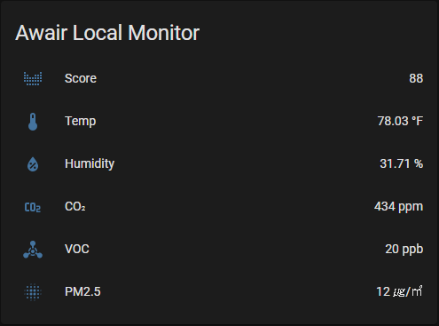

# AWAIR Local Sensor

AWAIR Local Sensor for Home Assistant.<br>

<br>

<br>

## Version history
| Version  | Date        | Contents
| :------: | :---------: | ------------------------------------------
| v1.0.0   | 2020.06.30  | First version
| v1.0.1   | 2020.07.02  | Add unit_of_measurement
| v1.1.0   | 2020.07.29  | Add air-data attribute
| v1.1.0.1 | 2020.12.31  | Changed domain to avoid conflict
| v1.1.1   | 2021.03.09  | manifest.json add version attribute.json

<br>

## Installation
### Manual
- Put the file in custom_components under the HA installation path.<br>
  `<config directory>/custom_components/awair/__init__.py`<br>
  `<config directory>/custom_components/awair/manifest.json`<br>
  `<config directory>/custom_components/awair/sensor.py`<br>
- Add the settings to the configuration.yaml file.<br>
- Restart Home-Assistant<br>

<br>

## Usage
### configuration
- Add awair sensor to your HA setup.<br>
```yaml
sensor:
  - platform: awair
    scan_interval: 60
    devices:
      - id: '[Your AWAIR Device ID]'
        name: '[Your AWAIR Device Name]'
        ip: '[Your AWAIR Device IP]'
```
<br><br>
### Default settings

|Option|Contents|
|--|--|
|name| (Option) Name / default(awair)|
|devices| (Required) AWAIR Devices |
|scan_interval| (Option) Sensor Update Interval / default(10s) |

<br>

### Device settings

|Option|Contents|
|--|--|
|id| (Required) AWAIR ID |
|name| (Required) AWAIR Nickname |
|ip| (Required) AWAIR Local IP |

<br>

### awair_type setting values

|Code|Value|Score|Temperature|Humidity|VOC|CO2|PM2.5|Light|Noise|
|--|--|--|--|--|--|--|--|--|--|
|S| 2nd Edition |O|O|O|O|O|O|X|X|
|M| Mint |O|O|O|O|X|O|O|O|
|O| Omni |O|O|O|O|O|O|O|O|
|E| Element |O|O|O|O|O|O|X|X|

<br>
